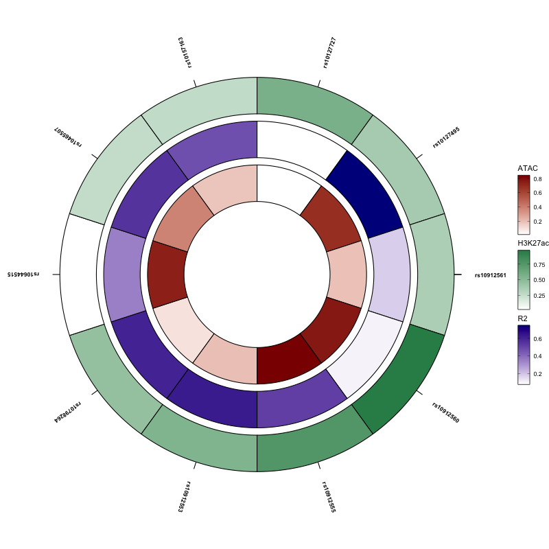

# ggRings
Creating circular heatmaps with ggplot2

# Install
devtools::install_github("ofircohn/ggRings")

# Example 
library(ggRings)

```r
plot_circular_rings(
  data = geneOfInterest,
  ring_cols = c("ATAC", "R2", "H3K27ac"),
  annotation_col = "rs",
  ring_colors = c("darkred", "darkblue", "seagreen"),
  annotation_distance = 0.5,
  add_ticks = TRUE,
  tick_length = 0.1,
  title = NULL,
  fill_low = "white"
)

## Example Plot


